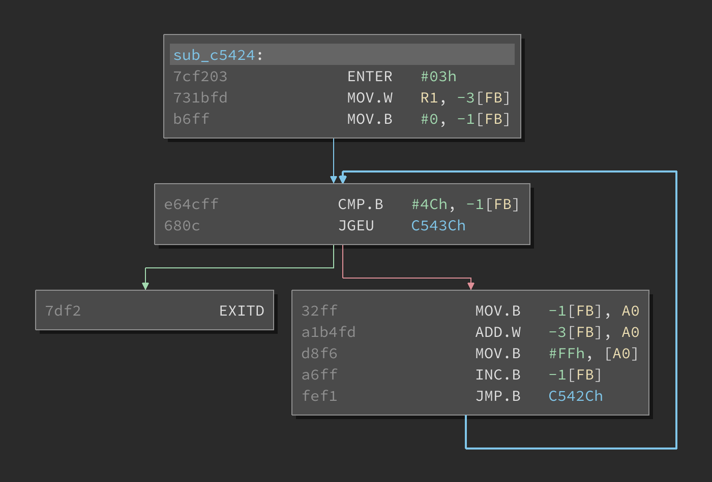

# Binary Ninja Renesas M16C plugin

The Renesas M16C plugin provides the corresponding architecture for Binary Ninja.

## Features

This plugin decodes all M16C instructions and provides control flow analysis. It also detects with a high degree of confidence, and relocates raw binary M16C ROM dumps.

This plugin does not currently provide lifting or SFR definitions.

## License

[0-clause BSD](LICENSE-0BSD.txt)
